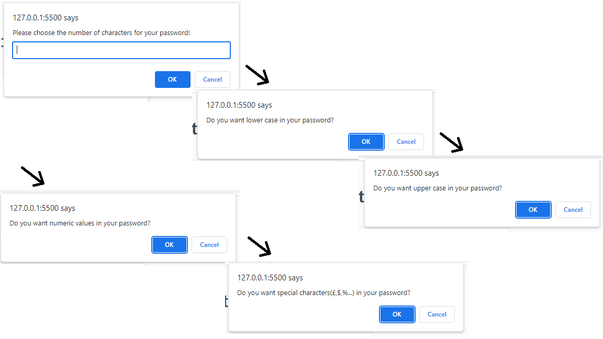

## My portofolio

## Description 

 This project consists in a web application that gives the user the posibility to generate a password.
 The user is given the choice of numbers of characters (between 8 and 128) and type of characters ( lower, upper, numerical and special).
 The website should look similar to the screenshots below:

The website can be visited here: https://ibalan92.github.io/password-generator/

## Installation

N/A

## Contact

If you find any errors in the code or any malfunction, please "pull request" on github and I will review it. 

## License

Please refer to the LICENSE in the repo.